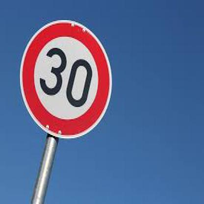
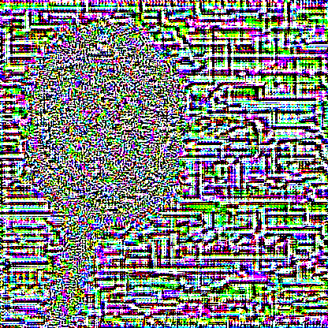
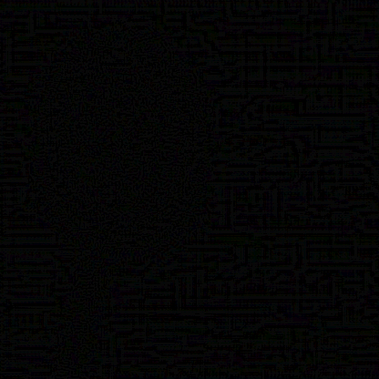
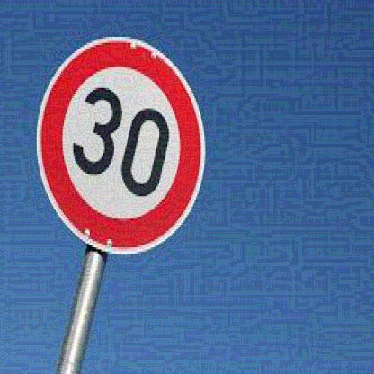
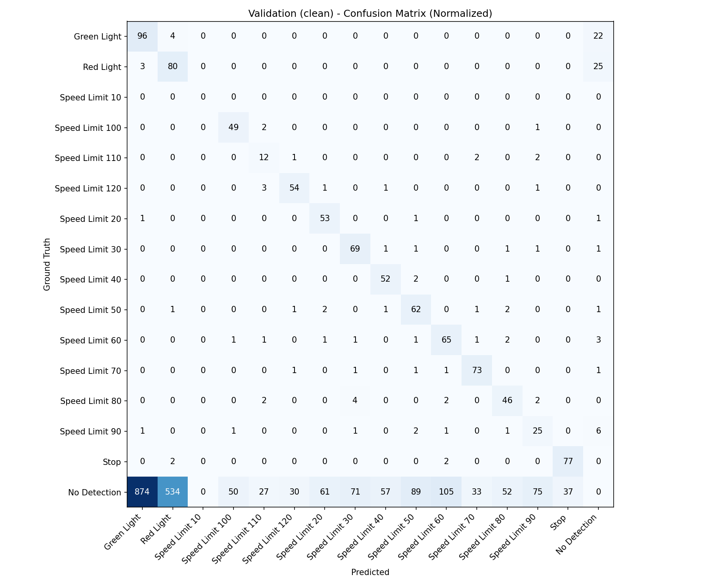
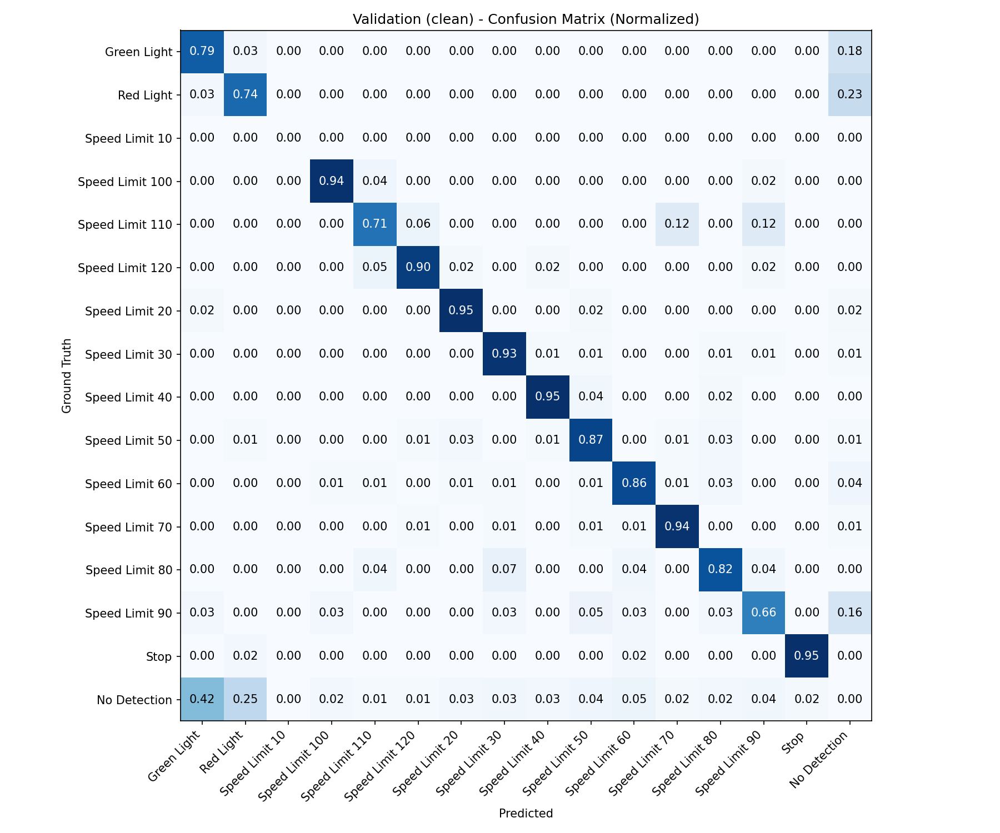
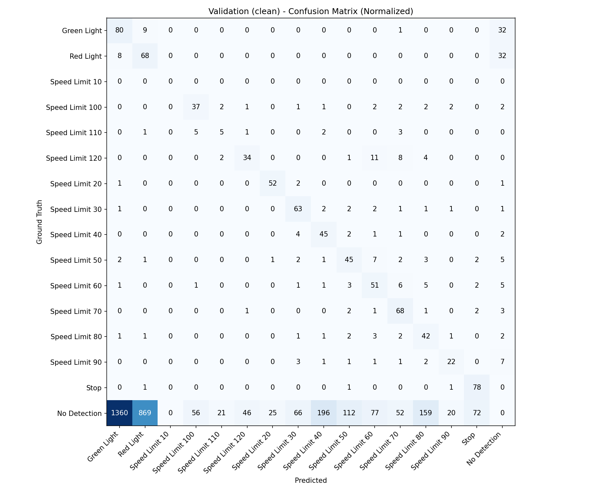
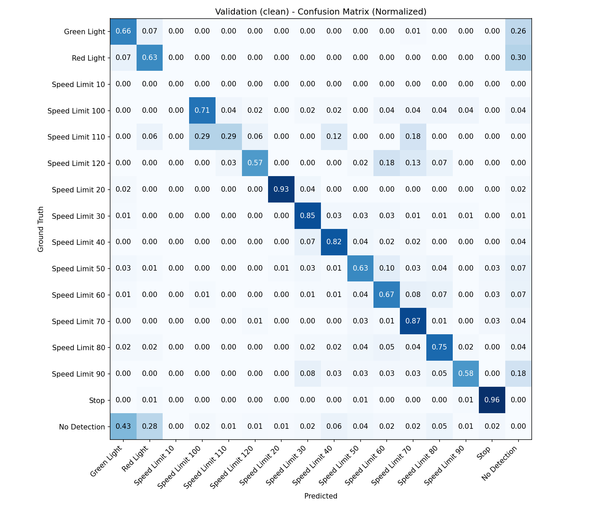

# YOLO Adversarial Attack

## Overview

The aim of the project is to implement an **adversarial attack** against YOLO-based object detectors using untargeted **FGSM** (Fast Gradient Sign Method).

Additionally, evaluation of **confusion matrices** is performed on a validation dataset **before and after the attack**.

The goal is to generate visually small perturbations that are hardly recognizable for humans and significantly reduce detection accuracy.

---

## Tech Stack

### Languages & Frameworks
- **Python** – Core programming language  
- **PyTorch** – Deep learning framework for training and evaluating YOLO models  
- **YOLO (You Only Look Once)** – Object detection architecture (YOLOv8)

### Scientific & Utility Libraries
- **NumPy** – Numerical operations and array manipulation  
- **Pandas** – Data loading and preprocessing  
- **Matplotlib** – Visualization and plotting  

### Environment & Tooling
- **uv** – Dependency management and execution  
- **Jupyter Notebooks** – Interactive experimentation and prototyping  

---

## Usage with uv

This project uses **[uv](https://docs.astral.sh/uv/)** for environment management, dependency resolution, and running scripts.

### 1. Sync dependencies and create virtual environment

```bash
uv sync
````

This command will:

* Create a virtual environment
* Install all dependencies listed in `pyproject.toml`

---

### 2. Run the adversarial FGSM attack

Example using your CLI arguments:

```bash
uv run src/main.py \
  --model ./model/train/weights/best.pt \
  --img-dir ./car/valid/images \
  --labels-dir ./car/valid/labels \
  --adv-img-dir ./results/adv_images \
  --confusion-matrix-dir ./results/attack_results \
  --pert-with-eps-dir ./results/pert_img_with_eps \
  --pert-dir ./results/pert_img \
  --eps 0.031 \
  --max-img 0 \
  --device cuda \
  --iou-threshold 0.5 \
  --conf-threshold 0.25 \
  --train False
```

#### Argument Descriptions

* `--model` – Path to YOLO model `.pt` file
* `--img-dir` – Directory containing validation images
* `--labels-dir` – Directory containing YOLO-format label files
* `--adv-img-dir` – Directory to save adversarial images
* `--confusion-matrix-dir` – Directory to save confusion matrices and CSV files
* `--pert-with-eps-dir` – Directory to save perturbation × epsilon visualizations
* `--pert-dir` – Directory to save raw perturbation images
* `--eps` – FGSM perturbation magnitude (default: 8/255)
* `--max-img` – Process only the first N images; 0 = all images
* `--device` – Device to use: `cpu`, `cuda`, or `mps`
* `--iou-threshold` – IoU threshold for matching predictions to ground-truth boxes
* `--conf-threshold` – Confidence threshold; filter predictions below this value
* `--train` – Whether to train the model (True/False)

---

### 3. Simplest way for running 

```bash
uv run src/main.py 
```

Launches a notebook server using the uv-managed environment.

---

### 4*. Jupyter notebook

Jupyter notebook is for development purposes only. 
It is not necessary for correct application work, rather for future improvements in the model work. 

---

## Code Quality

The project uses **type checking** and **linting** to maintain code quality.

For running the test install additional dependencies 

```bash
uv sync --extra dev
```

---

### Run tests
```bash
uv run pytest
```

### Run with coverage
```bash
uv run pytest --cov=attack
```

### Run only utils tests:
```bash
uv run pytest tests/test_utils.py
```

---

### Type Checking with mypy

```bash
uv run mypy src tests
```

Checks all Python files under `src/` and `tests/` for type consistency.

---

### Linting with ruff

```bash
uv run ruff check src tests
```

Detects style issues, unused imports, and other common Python errors.

---

### Run lint + format + typing
```bash
uv run ruff format
uv run ruff check src tests
uv run mypy src tests
```

---

### Reformatting with ruff

```bash
uv run ruff format
```

Automatically reformats all Python files in the project.

---

Those functions ensures:

* Code is properly formatted
* Type-safe
* Free of common linting issues

---

## Results


After running the attack, the following outputs are generated:

* **Adversarial images** 
* **Perturbation maps** 
* **Perturbation × epsilon visualizations** 
* **Confusion matrices and CSVs** 

These outputs allow both **quantitative and qualitative** evaluation of YOLO robustness against FGSM attacks.

### Images 

Example image from the dataset before attack is:




Perturbations generated for an image (before multiplication by epsilon value):




Perturbations added to an image (after multiplication by epsilon value):




Final adversarial image:




### Confusion matrices

For comparing the results after and before attack, confusions matrices were generated.

#### Confusion matrices before attack

| Unnormalized matrix | Normalized matrix |
|---------------------|-------------------|
|  |  |

#### Confusion matrices after attack

| Unnormalized matrix | Normalized matrix |
|---------------------|-------------------|
|  |  |

We can observe significant decrease in recognition the objects, even though the changes in the images are very small.


---

## Future improvements

Containerization with **Docker**, are considered to be implemented in the future, for better reproducibility.


## Notes

* The project assumes YOLO-format labels (`.txt`) with normalized coordinates.
* Large datasets and generated outputs should not be committed to version control.
* GPU execution (`cuda`) is recommended for faster inference.

